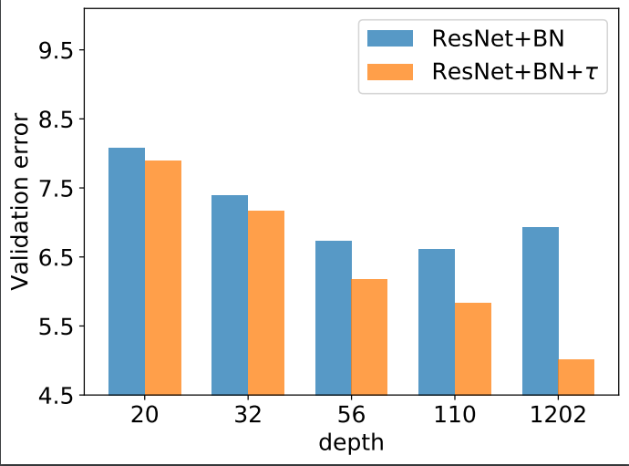

# tau-ResNet

This repo implements the experiments presented in "Convergence Theory of Learning Over-parameterized ResNet: A Full Characterization" (https://arxiv.org/abs/1903.07120).

The codes are tested using Python 3.6 and Pytorch 1.0.

# Experiments on CIFAR10

First open the cifar floder.

You can train a Resnet110 baseline model by the following command. Other ResNets are supported for depth 20/32/44/56/1202. The program would download the dataset automatically if this is first running.

```
CUDA_VISIBLE_DEVICES=0 python cifar_train.py --arch resnet110 --sess baseline
```

The network architecture and hyperparameters are the same as in "Deep Residual Learning for Image Recognition". The result can be found in the result folder. 

Beyond the original ResNet, we suggest using a scale factor tau=O(1/sqrt(L)) on top of each residual block, where L is the number of residual blocks (54 for resnet110). 

The following command trains the Resnet110 model with tau=1/sqrt(54)=0.136.

```
CUDA_VISIBLE_DEVICES=0 python cifar_train.py --arch resnet110 --tau 0.136 --sess tau0.136
```

The following chart shows the comparison between tau-ResNet and ResNet with different depths. We can see that tau-ResNet improves over original ResNet by a considerable margin, especially for deep ResNet.



You can also train Resnet model without batch normalization. The following command trains Resnet110 model without any bn layer.

```
CUDA_VISIBLE_DEVICES=0 python cifar_train.py --arch resnet110_nobn --tau 0.136 --sess tau0.136_nobn
```

Set tau=0.5/sqrt(L) (0.068) would lead to better performance. When withoutbn, the training explodes for large tau, which implies that tau=O(1/sqrt(L)) is a sharp value determining the trainability.

# Experiments on ImageNet

Go to the imagenet folder. You need to download the ImageNet classification dataset from http://www.image-net.org/challenges/LSVRC/2012/ first.

We set L as the largest number of blocks over all stages. The following command trains the Resnet101 model with tau=0.4. Other ResNets are supported with depth 50/152. 

```
python imagenet_train.py --arch resnet101 --tau 0.4 --sess imagenet_tau0.4 --data_dir data_folder_path
```

The following command trains the Resnet101 model without batch normalization.

```
python imagenet_train.py --arch resnet101_nobn --tau 0.4 --sess imagenet_tau0.4_nobn --data_dir data_folder_path
```
